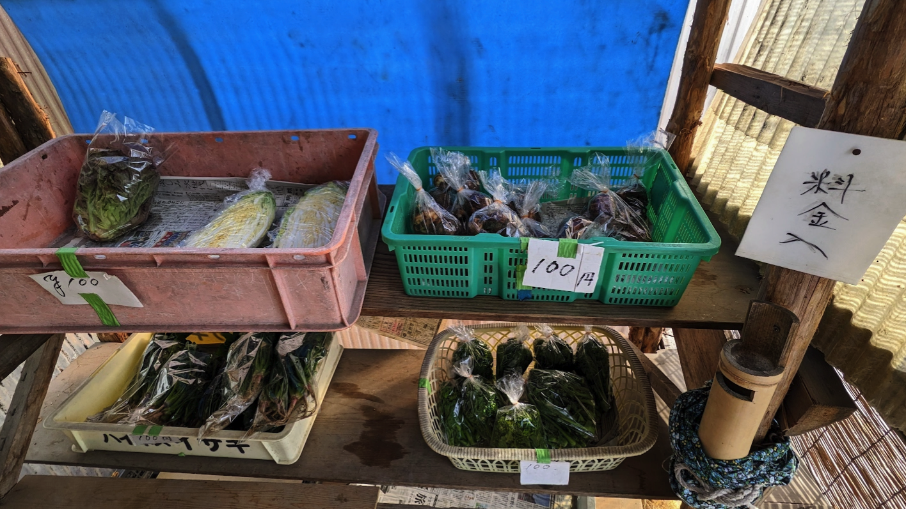

# Week 2

<xl>

Spatial Data Exploration

</xl>

https://ucla.zoom.us/j/96734931456

January 16, 2023

##
<xl>

*Note that this course will be recorded🎥

</xl>

##

<xl>
A little taste of the Japanese countryside
</xl>

##

##

##

## Hands on Lab
First, grab the course material, and "pull" it into your JupyterHub:

* [UP221 Git Puller](https://jupyter.idre.ucla.edu/hub/user-redirect/git-pull?repo=https%3A%2F%2Fgithub.com%2Fyohman%2F23W-UP221&urlpath=lab%2Ftree%2F23W-UP221%2F&branch=main) 
(This link will automatically launch JupyterHub and clone the course material into your directory)

<small>Note that you have to do this at the start of every lecture to get the latest material.
</small>

# Assignments (due 23:59 Sunday, the day before class)

## Individual assignment: Data Exploration

### Create a token

In order to pull and push content to GitHub, you must first create a token, which will serve as your password. Refer to this tutorial to create your token:

* [How to create a token](../../Git%20related/Create%20a%20token.md)

### Clone your repo

This is your first code assignment submission. Before you begin, create a clone of your repo in JupyterHub.

* [How to clone your repo into JupyterHub](../../Git%20related/Clone%20repo%20to%20hub.md)

### Submission guidelines:

- Find and download a dataset of your choice. This can be a shapefile, csv file, or json file. For many of you, you may have already done this as part of your week 1 assignments.
- Launch JupyterHub, go to your `up206a` repo folder, and create a `week01` folder.
- Load the dataset to the `up206a/week01` folder.

### 
Create a new python notebook 
**Do not** work on a copy of the lab notebook

<kbd></kbd>

###

Right click on the `Untitled.ipynb` tab and rename the notebook to `week 1 assignment.ipynb`

<kbd></kbd>

###

Add an introductory markdown cell with a title (header) and paragraph that describes what you are doing.

###

Import the data, and conduct data exploration, making sure to document your steps and your preliminary findings. At minimum, run the following commands:

* `.shape`
* `.info`
* `.head()`
* `.plot()`
* `.value_counts()`
* run a query on the data that filters it in some way

###

For each code cell, add a markdown cell that explains what you are doing.

Add markdown cells that describe the output of each operation.

Save your notebook.

### Commit your changes to your GitHub class repo.

Commit your changes to your GitHub repo by following these instructions:

* [How to commit and push to your repo](../../Git%20related/Commit%20and%20push.md)

### Submit your assignment 

The last step is to submit your assignment to the class repo discussion section [here](https://github.com/yohman/22W-UP206A/discussions/7).
